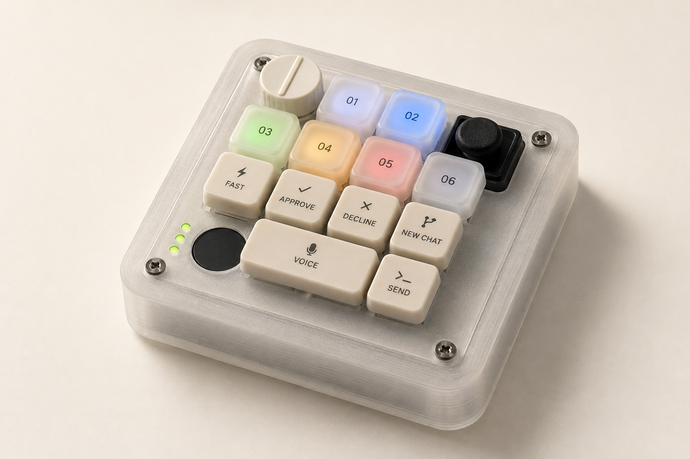

[](https://codexmicro.diy)

*AI-generated concept render of the DIY prototype, with functional key labels.*

# I wanted the OpenAI keyboard, but it was sold out.

So I decided to build one. 

I wanted to buy the [OpenAI × Work Louder Codex Micro](https://openai.com/supply/co-lab/work-louder/). Small keyboard, little dial, glowing keys. Very much my kind of thing.

I have a 3D printer. So I decided to put together a guide to making my own version—and share the files for anyone who wants to do the same.

This is that guide: a way to explore the parts, watch how they fit together, download the CAD, and work through the build. Credit for the original device goes to OpenAI and Work Louder. This project is a tutorial for a DIY recreation of their Codex Micro.

**[Open the interactive build guide →](https://codexmicro.diy)**

## What's here

- An interactive 3D model. Click a part for its print files or a purchase link for bought components.
- An eleven-stage assembly animation, including the bits hidden inside the case.
- Ten clickable assembly lessons with focused CAD views, before/after and replay controls, wiring diagrams, and explanations of how and why each step works.
- Printable STL files, editable STEP files, and parametric CAD source.
- A compact parts checklist that saves your selections in your browser, plus filament choices, wiring, assembly instructions, and starter firmware.
- One continuous page with a table of contents in build order.

## Where the build stands

The CAD is a dimensioned prototype reconstructed from the reference layout and standard parts. It is not the manufacturer's CAD. The meshes have passed geometry checks, but the enclosure has not been physically printed and the electronics have not been bench-tested here.

The custom KB2040 firmware provides generic USB inputs and manual LED control. **It does not yet reproduce the full native Codex integration.** OpenAI documents native support for the genuine Codex Micro and Creator Micro 2. Retaining genuine electronics is the documented route to those features; adapting the printed case to a donor board still requires measurements and a mechanical revision.

The guide explains both routes so you can decide what to build before buying a pile of parts.

## Run the site

Requires Node.js 22 or newer.

```sh
npm ci
npm run viewer
npm run dev
```

Open `http://localhost:3007`.

```sh
npm run build
npm start
```

`npm run build` regenerates the viewer and checks the catalog, model mappings, geometry buffers, and download links before building Next.js.

The live site is hosted on Vercel. Pushing to `main` automatically builds and deploys the site.

## Project map

- `app/` and `components/`: the single-page Next.js app.
- `data/parts.json`: part descriptions, quantities, specifications, purchase links, and print files.
- `data/instructions.json`: the checked-in assembly, printing, compatibility, and software instructions.
- `data/assembly-lessons.json`: the ten lessons, their part lists and resources, and which CAD components each focused view shows.
- `viewer-src/`: the Three.js assembly player, actual CAD meshes, and model-to-catalog mappings.
- `public/downloads/`: the complete CAD, wiring, firmware, original offline guide, and build package.

To update the model, edit `viewer-src/assembly.js` or its source geometry, then run `npm run viewer`. Every selectable model component maps to a catalog entry in `viewer-src/part-map.json`; subcomponents such as LED boards and copper foil have their own part identifiers.

The CAD source and its Python dependencies live in `public/downloads/cad/` and `public/downloads/requirements.txt`. Keep Python virtual environments outside `public/`. The original CAD and firmware rebuild instructions are included in the downloadable guide.

## Credits

- Original device: [OpenAI × Work Louder](https://openai.com/supply/co-lab/work-louder/).
- Native setup and behavior: [OpenAI's Codex Micro guide](https://learn.chatgpt.com/docs/features/codex-micro).
- 3D rendering: Three.js, with its MIT license included in `viewer-src/THREE-LICENSE.txt`.
- Hero image: generated from the project's CAD using the built-in image-generation tool. [Image prompt](docs/hero-image-prompt.md).
- GitHub icon: [Primer Octicons](https://github.com/primer/octicons), with its MIT license in `public/licenses/octicons.txt`.

An independent DIY tutorial, not an official OpenAI or Work Louder product. Seller links are ordinary product and catalog links; availability can change.
